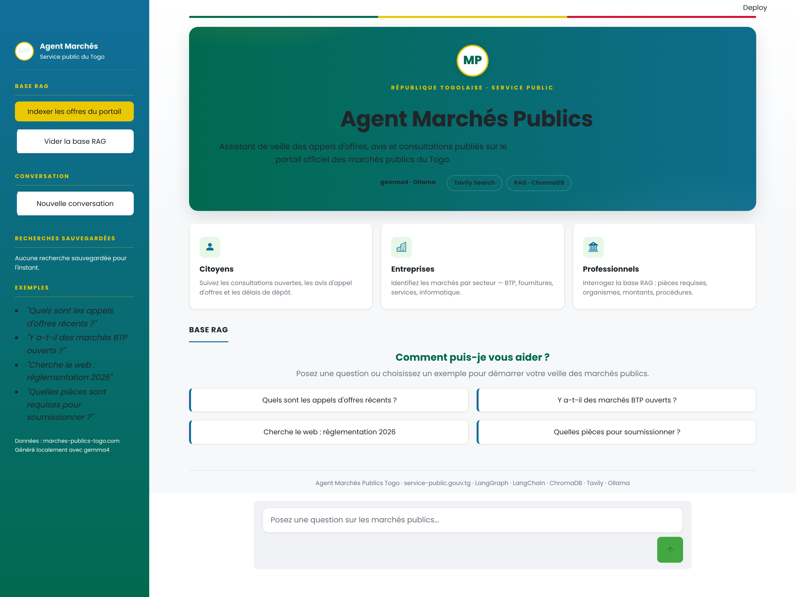

# Agent Marchés Publics — Togo 🇹🇬

Assistant de veille des **appels d'offres et avis de marchés publics du Togo**, propulsé par un agent ReAct (LangGraph + LangChain) combinant **recherche vectorielle (RAG)**, **recherche web** et **scraping**. L'interface Streamlit est stylée d'après le portail officiel [service-public.gouv.tg](https://service-public.gouv.tg).



---

## Fonnalités

- **Veille RAG** — indexe les offres scrapées depuis `marches-publics-togo.com` dans une base vectorielle ChromaDB et répond avec les sources.
- **Recherche web & scraping** — complète la base RAG via Tavily et extraction du contenu des pages.
- **Recherche par secteur** — `trouver_par_secteur` (BTP, Fournitures, Informatique, Services, Autre) et `offres_recentes`.
- **Suggestions cliquables** dans le chat (état vide guidé).
- **Recherches sauvegardées** — historique de session dans la barre latérale.
- **UI institutionnelle** — palette teal/vert/bleu du portail, police Poppins, cartes, sidebar, bouton de chat.

## Architecture

| Fichier | Rôle |
|---|---|
| `agent.py` | Agent ReAct (gemma4 via Ollama + outils), prompt système. |
| `tools.py` | Outils : `web_search`, `scrape_web`, `rag_search`, `indexer_marches`, `trouver_par_secteur`, `offres_recentes`. |
| `rag.py` | Indexation / recherche ChromaDB (embeddings `nomic-embed-text`). |
| `scrapper.py` | Scraping du portail des marchés publics (BeautifulSoup). |
| `app.py` | Interface Streamlit (UI clonée service-public.gouv.tg). |
| `main.py` | Point d'entrée CLI. |

## Outils de l'agent

1. `rag_search(query, secteur)` — recherche dans la base vectorielle.
2. `web_search(query)` — recherche web (Tavily).
3. `scrape_web(url)` — extraction du contenu d'une page.
4. `indexer_marches()` — scrape + indexe les offres du portail.
5. `trouver_par_secteur(secteur)` — liste les offres d'un secteur.
6. `offres_recentes(k)` — dernières offres indexées.

## Démarrage

### Prérequis

- Python ≥ 3.13 (géré via `uv`)
- Ollama local avec les modèles `gemma4:e2b` et `nomic-embed-text`
- Clé `TAVILY_API_KEY` dans `.env`

### Installation

```bash
uv sync
cp .env.example .env   # puis renseignez TAVILY_API_KEY
ollama pull gemma4:e2b
ollama pull nomic-embed-text
```

### Lancer l'interface

```bash
streamlit run app.py
```

### Lancer le CLI

```bash
python main.py --init   # indexe d'abord, puis chat
```

## Stack

LangGraph · LangChain · ChromaDB · Tavily · Ollama (gemma4, nomic-embed-text) · Streamlit · BeautifulSoup · Bootstrap Icons · Poppins.

---

*Projet de démonstration — données issues de marches-publics-togo.com. Usage à des fins de veille et d'illustration.*
